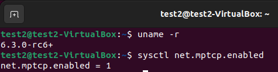

# MPTCP v1

En este repositorio se muestran los pasos a seguir para la elaboración de un escenario simple con dos máquinas virtuales conectadas entre sí entre las que se ejecuta MPTCP v1.
### Instalación de las máquinas virtuales
Para crear el escenario se ha utilizado la herramienta *Oracle VM VirtualBox*, un software de virtualización para arquitecturas x86/amd64. Es recomendable utilizar la última versión que haya en el momento y que no muestre problemas ya que ofrece mayor compatibilidad con máquinas con kernels nuevos. Los pasos a seguir son:
- Ir a la página oficial de Oracle y descargar la versión correspondiente del [software](https://www.virtualbox.org/wiki/Downloads).
- Ir a la página oficial de Ubuntu y descargar la [imagen](https://releases.ubuntu.com/jammy/) de la versión de Ubuntu que se quiera para las máquinas. La última versión disponible en este momento es la 22.10 pero al no ser LTS (Long Term Support) se escoge la 22.04. (Que una versión sea LTS implica que tendrá soporte y será actualizada durante más tiempo que una versión normal y además suele ser más estable y ha sido probada por más usuarios).
- Crear dos máquinas virtuales en VirtualBox con dicha imagen (Ue1 y Ue2) con las siguientes características (a modo de guía):
	- Memoría de 2048 MB y 2 núcleos.
	- Disco virtual de 20 GB mínimo.
	- 4 interfaces de red (Adaptador NAT y 3 interfaces conectadas a una misma red interna con nombre *ue1-ue2*).

Una vez se han instalado ambas máquinas  en VirtualBox, se inician y se ponen en marcha siguiendo los pasos de instalación de Ubuntu que van apareciendo en pantalla.

### Instalación del kernel de Linux 6.1.18
Si se han seguido los pasos del apartado anterior, ya se tienen las dos máquinas virtuales con Ubuntu 22.04 funcionando. Ahora es momento de elegir el kernel sobre el que se va a trabajar. Echando un vistazo a la wiki del proyecto [*Upstream MPTCP*](https://github.com/multipath-tcp/mptcp_net-next/wiki)  (comunidad que se encarga de desarrollar, mantener y mejorar el protocolo Multipath TCP (MPTCP) (v1/RFC 8684) en el kernel de Linux ascendente). Los *upstream Linux kernels* son aquellos que empiezan en la versión 5.6 y posteriores. 
En el apartado ChangeLog se pueden ver los diferentes kernels a partir de los cuales la versión 1 MPTCP ya viene incorporada, y las funcionalidades que añaden cada uno. Lo ideal sería escoger la versión más reciente del kernel pero por los mismos motivos por lo que se escogió Ubuntu 22.04, se va a escoger el kernel versión 6.1, en concreto, la versión 6.1.18 (casi diariamente surgen versiones nuevas por lo que es posible que cuando el usuario esté leyendo este guión, esta versión ya no sea la última del kernel 6.1).
Para llevar esto a cabo, basta con descargar los paquetes necesarios e instalarlos. Hay muchos sitios web donde se pueden encontrar pero uno de los más sonados es [este](https://kernel.ubuntu.com/~kernel-ppa/mainline/).
Los comandos a seguir son los siguientes:
~~~
wget -c https://kernel.ubuntu.com/~kernel-ppa/mainline/v6.1.18/amd64/linux-headers-6.1.18-060118-generic_6.1.18-060118.202303111330_amd64.deb
wget -c https://kernel.ubuntu.com/~kernel-ppa/mainline/v6.1.18/amd64/linux-headers-6.1.18-060118_6.1.18-060118.202303111330_all.deb
wget -c https://kernel.ubuntu.com/~kernel-ppa/mainline/v6.1.18/amd64/linux-image-unsigned-6.1.18-060118-generic_6.1.18-060118.202303111330_amd64.deb
wget -c https://kernel.ubuntu.com/~kernel-ppa/mainline/v6.1.18/amd64/linux-modules-6.1.18-060118-generic_6.1.18-060118.202303111330_amd64.deb
~~~
Una vez descargados los paquetes, se deben instalar y reiniciar la máquina para que los cambios se guarden:
~~~
sudo dpkg -i *.deb
reboot
~~~
Al reiniciarla se puede comprobar como ahora se tiene instalado y funcionando dicho kernel con el comando `uname -r` y como MPTCP viene activado por defecto mediante `sysctl net.mptcp.enabled`.

